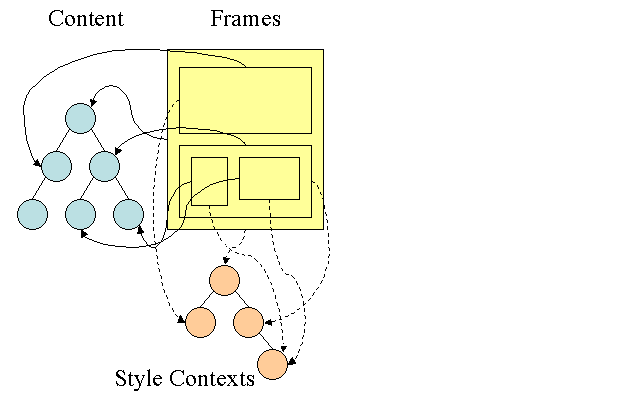
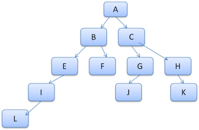
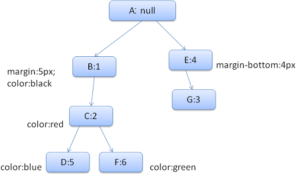
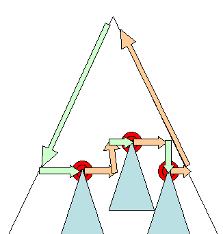

笔者对《浏览器工作原理》一文进行了翻译。该仓库为翻译后的文档。英文原文链接如下：<http://taligarsiel.com/Projects/howbrowserswork1.htm>

主要内容如下：

<hr>


[TOC]


# 1. 浏览器的主要功能

浏览器的主要功能是通过向服务器请求并在浏览器窗口上显示您所选择的Web资源。资源格式通常是HTML，但也包括PDF，图像等等。资源的位置由用户使用URI（统一资源标识符）指定。HTML和CSS规范中指定了浏览器解释和显示HTML文件的方式。

浏览器的用户界面有很多共同之处。常见的用户界面元素包括：

- 用于插入URI的地址栏
- 后退和前进按钮
- 书签选项
- 用于刷新和停止加载当前文档的刷新和停止按钮
- 主页按钮，让你到你的主页

# 2. 浏览器的基本结构

浏览器的主要组件是：

1. **用户界面** - 包括地址栏，后退/前进按钮，书签菜单等。浏览器的每个部分都显示除了主窗口，您可以看到请求的页面。
2. **浏览器引擎** - 查询和操作渲染引擎的界面。
3. **渲染引擎** - 负责显示请求的内容。例如，如果请求的内容是HTML，则它负责解析HTML和CSS，并在屏幕上显示解析的内容。
4. **网络** - 用于网络呼叫，如HTTP请求。它具有与平台无关的接口，并在每个平台的底层实现。
5. **UI后端** - 用于绘制组合框和窗口等基本小部件。它公开了一个不是平台特定的通用接口。它下面使用操作系统用户界面方法。
6. **JavaScript解释器**。用于解析和执行JavaScript代码。
7. **数据存储**。这是一个持久层。浏览器需要保存硬盘上的各种数据，例如cookie。HTML5定义了“web数据库”，它是浏览器中的完整（尽管是轻量级）数据库。


> Chrome浏览器拥有多个渲染引擎实例 - 每个标签一个。每个选项卡是一个单独的过程。

# 3. 渲染引擎

​	渲染，即在浏览器屏幕上显示所请求的内容。默认情况下，渲染引擎可以显示HTML和XML文档和图像。除此之外，它可以通过插件（浏览器扩展）显示其他类型，例如，使用PDF查看器插件显示PDF。	

> Firefox使用Gecko--一种“自制”的Mozilla渲染引擎。Safari和Chrome都使用Webkit。其中，Webkit是一个开源渲染引擎，作为Linux平台的引擎启动，并由Apple修改以支持Mac和Windows。

​	渲染引擎一般从网络层以8K块的形式开始获取所请求文档的内容，然后开始解析HTML文档。它首先解析HTML文档中的标签来建立DOM树，同时解析外部CSS文件和样式元素中的样式数据。其次根据样式信息和HTML中的可视指令来创建渲染树，进行渲染布局。此时，每个节点拥有了确切的坐标。最后，遍历渲染树，将每个节点使用UI后端图层进行绘制。流程图见下文。

> - 渲染树包含具有可视属性（如颜色和尺寸）的矩形。这些矩形按照正确的顺序显示在屏幕上。
> - 为了更好的用户体验，渲染引擎会尝试尽快在屏幕上显示内容。在开始构建和布置渲染树之前，它不会等到所有的HTML被解析。部分内容将被解析并显示，而同时解析来自网络的其余内容。


## 3.1 两种常见的渲染引擎流程

- **webkit主流程图：**


- **Mozilla的Gecko渲染引擎主流程：**


​	从以上两张流程中可以看出，虽然Webkit和Gecko使用的术语略有不同，但流程基本相同。唯一的区别是Gecko在HTML和DOM树之间有一个额外的层——它被称为“content sink”，是制作DOM元素的工厂。

## 3.2 解析基本概念

​	**解析文档**意味着将其翻译成某种合理的结构 - 代码可以理解和使用的结构。**解析的结果**通常是代表文档结构的**节点树**。它被称为**分析树或语法树**。举个例子，学过数据结构中分析公式时的后缀（前缀、中缀）公式的读者都知道，一个数学计算式"2 + 3 - 1"可以被表达称为如下的树：


​	也就是说，遵循一定的语法，便可以将HTML文档解析构建成一种分析树。而这种语法一般为由特定的词汇规则和语法规则组成的确定性语法，即与实际显示的内容无关。在浏览器中一般通过**解析器**进行HTML解析。

### 3.2.1 解析器(语法规则)

​	解析器就和语法规则一样，由两部分组成——词法（词汇）分析和语法分析。词法分析，就是将文档内容根据特定的词汇（或者标记）分解为有效标记的过程；除此之外，它可以自动去除不相关的字符，如空格和换行符。语法分析，则是根据文档语言规则进行解析的过程。所以解析就是在词法分析之后，根据语法规则来分析文档并建立解析树的过程。如下图所示。


但是，值得注意的是，解析过程是迭代的。

- 解析器通常会向词法分析器请求一个新的标记，并尝试将该标记与其中一个语法规则进行匹配。
- 如果规则匹配，则将与该令牌相对应的节点添加到解析树中，解析器将请求另一个令牌。 
- 如果没有规则匹配，解析器将在内部存储该令牌，并继续询问令牌，
  - 直到找到与所有内部存储的令牌匹配的规则。
  - 如果没有规则被发现，则解析器将引发异常。这意味着文档无效并包含语法错误。

### 3.2.2 编译

浏览器需要将解析后的内容编译为机器语言以便执行相应的操作。


### 3.2.3 解析示例

#### 语法定义	

以前文的数学计算式"2 + 3 - 1"为例来建立一个解析树。假设我们现在要尝试定义一种简单的数字计算语言来分析整个解析过程。

词汇(词法、Vocabulary)：我们的数字计算语言可以包含整数、加法符号和减法符号。

语法(Syntax)：

- 1.我们的语言语法构建块有表达式、术语和操作符。
- 2.我们的语言包含任意数量的表达式。
- 3.一个表达式可以被定义为”一个术语&一个操作符&另一个术语。
- 4.一个操作符可以是“+”或“-”。
- 5.一个术语可以是一个整数或者表达式。

接下来我们分析数学计算式"2 + 3 - 1"：

- ”2“根据第5条语法，它是一个术语
- ”2+3“根据第3条语法，它是一个表达式
- ”2+3-1“根据第5条、第2条和第3条语法，它是一个表达式
- ”2++“根据五条语法，匹配不到合适的构建块，则不是合法的数学计算式。

#### 词汇和语法的格式定义

词汇通常以正则表达式定义，在这个示例中：

```
INTEGER :0|[1-9][0-9]*
PLUS : +
MINUS: -
```

这样，整数就可以由一个正则表达式来定义。

而语法我们常常使用BNF（巴科斯范式）格式来定义。例如：

```
expression :=  term  operation  term
operation :=  PLUS | MINUS
term := INTEGER | expression
```

#### 解析器类型

有两种基本类型的解析器——**自上而下的解析器**和**自下而上的解析器**。

- 自顶向下的解析器会查看语法的高级结构并尝试匹配其中的一个。


- 自下而上的解析器从输入开始，逐渐将其转换为语法规则，从低级规则开始，直到满足高级规则。

继续看我们的例子：

- 自上而下解析器将从更高级别的规则开始 - 它将识别“2 + 3”作为表达式。然后，它将识别“2 + 3 - 1”作为表达式（识别表达式的过程演变为匹配其他规则，但起点是最高级别规则）。
- 自下而上的解析器将扫描输入，直到匹配规则，然后将匹配的输入替换为规则。这将持续到输入结束。部分匹配的表达式放置在解析器堆栈上。如下表，设想一个指针首先指向输入开始并向右移动。

| 堆           | 输入      |
| ------------ | --------- |
|              | 2 + 3 - 1 |
| 术语         | + 3 - 1   |
| 术语、操作   | 3 - 1     |
| 表达式       | - 1       |
| 表达式、操作 | 1         |
| 表达式       |           |

### 3.2.6 自动生成解析器

Webkit使用了两个众所周知的解析器生成器--Flex用于创建一个词法分析器和用于创建解析器的Bison（您可以使用名称Lex和Yacc来运行它们）。Flex输入是包含标记的正则表达式定义的文件。Bison的输入是BNF格式的语言语法规则。

## 3.3 HTML解析器

HTML解析器的工作是将HTML标记解析为解析树。

### 3.3.1 HTML语法定义

HTML的词汇和语法在w3c组织创建的[规范](http://taligarsiel.com/Projects/howbrowserswork1.htm#w3c)中定义。

### 3.3.2 不是上下文无关的语法

常见的上下文有关语法不适用于HTML（不包括CSS和JavaScript）有一种用于定义HTML的正式格式 - DTD（文档类型定义） - 但它不是上下文无关语法。

### 3.3.3 HTML DTD

HTML定义是DTD格式。这种格式用于定义[SGML](http://en.wikipedia.org/wiki/Standard_Generalized_Markup_Language)族的语言。格式包含所有允许的元素、它们的属性和层次结构的定义。

DTD有几个变种。只有严格模式符合规范，但其他模式包含对浏览器过去使用的标记的支持。目的是向后兼容较旧的内容。目前严格的DTD在这里：[http](http://www.w3.org/TR/html4/strict.dtd) : [//www.w3.org/TR/html4/strict.dtd](http://www.w3.org/TR/html4/strict.dtd)

### 3.3.4 DOM

输出树 - 分析树是DOM元素和属性节点的树。DOM是文档对象模型的简称。它是HTML文档的对象表示和HTML元素与外部世界的接口，如JavaScript。

树的根是“ [document](http://www.w3.org/TR/1998/REC-DOM-Level-1-19981001/level-one-core.html#i-Document) ”对象。

DOM与HTML标签几乎有一对一的关系。例如：

```html
<html>
	<body>
		<p>
			Hello World
		</p>
		<div> </div>
	</body>
</html>
```

转换成DOM树为：


像HTML一样，DOM由w3c组织指定。见<http://www.w3.org/DOM/DOMTR>。它是操作文档的通用规范。一个特定的模块描述HTML特定的元素。HTML定义可以在这里找到：[http](http://www.w3.org/TR/2003/REC-DOM-Level-2-HTML-20030109/idl-definitions.html) :[//www.w3.org/TR/2003/REC-DOM-Level-2-HTML-20030109/idl-definitions.html](http://www.w3.org/TR/2003/REC-DOM-Level-2-HTML-20030109/idl-definitions.html)。

### 3.3.5 关于HTML解析算法

正如我们在前面的章节中看到的那样，HTML不能使用常规的自顶向下或自底向上解析器进行分析。

原因是：

1. 该语言的宽容性。
2. 浏览器具有传统的容错功能以支持众所周知的无效HTML案例。
3. 可重入的解析过程。通常，解析过程中源不会更改，但在HTML中，包含“document.write”的脚本标记可以添加额外的标记，因此解析过程实际上会修改输入。

既然无法使用常规解析技术，那么浏览器会创建用于解析HTML的自定义解析器。解析算法由HTML5规范详细描述。该算法由两个阶段组成 - 标记化和树结构。

标记化是指词法(词汇)分析，将输入解析为token。HTML标记中包括开始标记，结束标记，属性名称和属性值。标记器识别该标记，将其提供给树构造函数，并使用下一个字符来识别下一个标记，直到输入结束。


### 3.3.6 关于HTML标记器算法

该算法的输出是一个HTML token。该算法可以视为一个状态机：其状态根据输入流的字符来确定，并根据之后的字符更新状态；它同时被当前token状态和整个构造树的状态影响。也就是说同样的字符由于当前状态的不同，可能会有不同的状态。我们在这里不铺开讲，仅仅看一个示例来理解。

如下示例；

```html
<html>
	<body>
		Hello world
	</body>
</html>
```


刚开始时，状态机的状态为数据（Data）。

当遇到`<html>`字符`"<"`时，状态切换为”Tag open state“，并表示开始创建开始标签令牌。接下来遇到的”a-z“字符均为”Tag name state“；直到我们遇到字符`”>“`。遇到字符`”>“`后，状态又切换为”Data state“。接下来的`<body>`标签处理是类似的。当遇到`</body>`时，首先由于遇到字符`"<"`，因此状态切换为”Tag open state“；紧随其后时字符`”/“`则告诉状态机，要创建结束标签令牌了；然后遇到的”a-z“字符均为”Tag name state“；直到遇到字符`”>“`后，状态又切换为”Data state“。`”</html>“`标签处理方式类似。

### 3.3.7 构建树算法

文档对象在分析器被创建时就开始被创建了。

- 在刚开始构造树时，首先文档的根标签将会修改DOM树的根元素，然后将元素添加到上面。
- 标记器里的每个节点标记都会被树构造器处理。
- 对于每个标记，HTML规范已经定义了哪个DOM元素与其相关，然后将为它创建元素。
- 除此之外，还会有嵌套不匹配和未封闭的标签被存储到堆栈中。

```html
<html>
	<body>
		Hello world
	</body>
</html>
```


如上图所示，构建树时的状态，输入来自之前标记器中的一些列标签令牌。初始状态叫做”init model“。当接收到html标签时，移动到”before html“模式，并重新在此模式下处理标签——创建HTMLHtmlElement元素，并将其添加到根Document对象。在本段代码中没有head标签，但是浏览器会隐含创建一个HTMLHeadElement兵添加到树中，然后进入”in head“模式；由于head没有设置，随后浏览器便通过默认设置进入”after head“模式。

​	之后遇到body标签，浏览器会创建HTMLBodyElement并将其便添加到树中，然后进入”in body“模式。

​	随后遇到”Hello world“字符串的字符标记：浏览器遇到第一个字符H时，会创建并向树中插入”text“节点；后续的字符会附带添加到此节点。

​	此时便会遇到`</body>`结束标签，状态切换为”after body“模式。同样的，遇到`</html>`后，状态切换为”after after body“模式。随后标记器中标签结束，则结束解析。

### 3.3.8 解析完成时的动作

在这个阶段，浏览器将文档标记为交互式，并开始解析处于“延迟”模式的脚本——那些在解析文档后应该执行的脚本。文档状态将被设置为“完成”并且“加载”事件将被触发。

 http://www.w3.org/TR/html5/syntax.html#html-parser

### 3.3.9 浏览器容错

例如：

```html
<html>
  <mytag>
  </mytag>
  <div>
  <p>
  </div>
  	Really lousy HTML
  </p>
</html>
```

可以看到，这段代码中，有用户自定义的`<mytag>`标签，浏览器并不知道；还有`div`和`p`标签嵌套错误。但是浏览器依旧可以正确显示内容。这就是浏览器容错。

HTML5规范中指出浏览器应当照顾以下错误情况：

- 若在一些外部标签内已经禁止的元素被添加到该外部标签内时，我们应该关闭外部标签，然后再添加该元素。
- 若不允许直接添加元素
  - 当遇到把一个块元素添加到一个内联元素时，应当先关闭所有内联元素，直到遇到更高级别的块元素。
  - 如果仍旧不起作用，则要么忽略该标签，要么允许我们直接添加该元素。

看一些实例：

#### 示例1：br

```html
</br> instead of <br>
```

`</br>`会被直接对待为`<br>`,并且不会报错。

```
if (t->isCloseTag(brTag) && m_document->inCompatMode()) {
     reportError(MalformedBRError);
     t->beginTag = true;
}
```

#### 示例2：表格不正确嵌套

不正确嵌套是指，一个表格不是另一个表格的一个单元格，而是一个表格包含另一个表格的内容。例如：

```html
<table>
	<table>
		<tr><td>inner table</td></tr>
         </table>
	<tr><td>outer table</td></tr>
</table>
```

Webkit会直接将上面这段代码修改为两个表格：

```html
<table>
	<tr><td>outer table</td></tr>
</table>
<table>
	<tr><td>inner table</td></tr>
 </table>
```

它的处理源码如下，webkit使用堆栈的方式来处理。

```
if (m_inStrayTableContent && localName == tableTag)
        popBlock(tableTag);
```

#### 示例3：表单嵌套

浏览器默认遇到嵌套的表单时，忽略第二个遇到的表单。

```
if（！m_currentFormElement）{
        m_currentFormElement = new HTMLFormElement（formTag，m_document）;
}
```

#### 示例4：过深的标签层次

一般只允许最多20个相同类型的嵌套标签，超过的自动忽略。

```
bool HTMLParser::allowNestedRedundantTag(const AtomicString& tagName)
{

unsigned i = 0;
for (HTMLStackElem* curr = m_blockStack;
         i < cMaxRedundantTagDepth && curr && curr->tagName == tagName;
     curr = curr->next, i++) { }
return i != cMaxRedundantTagDepth;
}
```

#### 示例5：错位的html或body结束标签

如之前构造树时的例子那样，浏览器从来不会关闭body标签，而是在文档实际结束之前关闭。

```
if (t->tagName == htmlTag || t->tagName == bodyTag )
        return;
```

## 3.4 CSS解析器

与HTML解析不同，CSS的解析时上下文无关的。CSS规范中的词汇和语法见链接：http://www.w3.org/TR/CSS2/grammar.html

我们先看一组例子：

```
comment		\/\*[^*]*\*+([^/*][^*]*\*+)*\/
num		[0-9]+|[0-9]*"."[0-9]+
nonascii	[\200-\377]
nmstart		[_a-z]|{nonascii}|{escape}
nmchar		[_a-z0-9-]|{nonascii}|{escape}
name		{nmchar}+
ident		{nmstart}{nmchar}*
```

例如，最后一行中的”ident“代表人类单词identifier的简写，就像CSS的类名、CSS中的id等一样。

CSS中的语法规则以BNF来描述，如下：

```
ruleset
  : selector [ ',' S* selector ]*
    '{' S* declaration [ ';' S* declaration ]* '}' S*
  ;
  
selector
  : simple_selector [ combinator selector | S+ [ combinator selector ] ]
  ;
  
simple_selector
  : element_name [ HASH | class | attrib | pseudo ]*
  | [ HASH | class | attrib | pseudo ]+
  ;
  
class
  : '.' IDENT
  ;
  
element_name
  : IDENT | '*'
  ;
  
attrib
  : '[' S* IDENT S* [ [ '=' | INCLUDES | DASHMATCH ] S*
    [ IDENT | STRING ] S* ] ']'
  ;
  
pseudo
  : ':' [ IDENT | FUNCTION S* [IDENT S*] ')' ]
  ;
```

根据这些语法，我们可以有这样一个CSS规则(如下代码)，其中的`div.error , a.error`为选择器，括号内的内容为规则集合的规则定义。请注意空格等各种符号。

```css
div.error , a.error {
	color:red;
	font-weight:bold;
}
```

### 3.4.1 Webkit CSS解析器

Webkit使用[Flex和Bison](http://taligarsiel.com/Projects/howbrowserswork1.htm#parser_generators)解析器生成器从CSS语法文件中自动创建解析器。Bison创建了一个自下而上的移位解析器。

> Firefox使用手动编写的自顶向下解析器。

每个CSS文件都被浏览器解析为一个StyleSheet对象，每个对象都包含CSS规则。CSS规则对象包含了选择器和声明对象以及与CSS语法对应的其他对象。见下图示例。


## 3.5 解析scripts

## 3.6 scripts和css处理顺序

### 3.6.1 javascript

脚本在web请求时是同步处理的。当解析器解析HTML时，遇到`<script>`标签时开始执行相应的javascript。此时文档解析暂停，直到javascript执行完毕。

若该javascript为外部js，则会先同步获取网络资源，但是不会暂停HTML解析；当js获取完毕后再暂停HTML解析执行js。

在HTML5中可以为javascript添加异步选项，由另外一个线程解析和执行脚本。

### 3.6.2 推测解析

Webkit和Firefox都做这种优化。在执行脚本时，另一个线程解析文档的其余部分，并找出需要从网络加载哪些其他资源并加载它们。这些资源可以在并行连接上加载，整体速度更好。注意：推测解析器不会修改DOM树并将其留给主解析器，它只解析对外部资源（如外部脚本，样式表和图像）的引用。

### 3.6.3 样式表

从单纯样式概念上看，由于样式表不会更改DOM树，所以没有理由等待它们并停止文档解析。但是，在文档分析阶段，javascript会询问样式信息。此时，若还未加载该样式，javascript获得的值就是错误的，这肯定不行。

因此，在Firefoc中，如果仍旧有正在加载或者正在解析的CSS，将会阻止javascript执行；在Webkit中，仅仅在javascript执行获取这些样式属性时停止执行javascript。

# 4. 渲染树

在构建DOM树时，浏览器会构建另一棵树，即渲染树。这棵树是按照它们显示顺序的可视元素。它是文档的可视化表示。此树的目的是为了以正确的顺序绘制内容。Firefox将渲染树中的元素称作”frames“；Webkit则成为渲染对象或者渲染器。每个渲染器会明确如何布局并绘图包含自己在内的所有子项。Webkit中的渲染器基类定义为：

```
class RenderObject{
	virtual void layout();
	virtual void paint(PaintInfo);
	virtual void rect repaintRect();
	Node* node;  //the DOM node
	RenderStyle* style;  // the computed style
	RenderLayer* containgLayer; //the containing z-index layer
}
```

每一个渲染器与相应的节点的CSS盒子模型意义对应。它包含了尺寸信息、显示属性信息等。例如Webkit创建渲染器时的源码：

```
RenderObject* RenderObject::createObject(Node* node, RenderStyle* style)
{
    Document* doc = node->document();
    RenderArena* arena = doc->renderArena();
    ...
    RenderObject* o = 0;

    switch (style->display()) {
        case NONE:
            break;
        case INLINE:
            o = new (arena) RenderInline(node);
            break;
        case BLOCK:
            o = new (arena) RenderBlock(node);
            break;
        case INLINE_BLOCK:
            o = new (arena) RenderBlock(node);
            break;
        case LIST_ITEM:
            o = new (arena) RenderListItem(node);
            break;
       ...
    }

    return o;
}

```

​	在Webkit中，如果一个元素想要创建一个特殊的渲染器，它将覆盖“createRenderer”方法。渲染器指向包含非几何信息的样式对象。

## 4.1 DOM树与渲染树的关系

​	**渲染器对应于DOM元素，但关系不是一对一的。**

- 非可视DOM元素将不会插入到渲染树中。例如，

  - “头”元素。
  - 元素其display属性被分配为“None”的元素不会出现在树中（具有“隐藏”可见性属性的元素将出现在树中）。

- 单个DOM元素对应于几个可视对象。这些通常是具有复杂结构的元素，不能用单个矩形来描述。例如，

  - “select”元素有3个渲染器 ： 一个用于显示区域，一个用于下拉列表框，一个用于按钮。
  - 当文本分成多行时，因为一行的宽度不够，新行将作为额外的渲染器添加。 
  - 破碎的HTML——根据CSS规范，内联元素必须只包含块元素或仅包含内联元素——在混合内容的情况下，将创建匿名块渲染器来包装内联元素。

- 一些渲染对象对应于DOM节点，但不在树中的相同位置。

  - 浮动和绝对定位的元素没有流动，放置在树中的不同位置，并映射到真实的框架。
  - 占位符框架应该是他们应该去的地方。


上图左边为DOM树，右边为渲染树。

## 4.2 渲染树的创建流

- 在Firefox中，当前渲染树任务被注册为一个可以监听DOM更新的事件。然后当前渲染树委托“FramerConstructor“来计算样式并创建一个渲染器。

- 在Webkit中，计算样式和创建渲染器的过程被称为”attachment“。并且该过程是同步的。每个DOM节点都有一个”attach“方法，当节点中插入一个新节点是，会调用新的”attach“方法。

- 渲染树根是在处理html和body标签时创建的。

  - 根渲染器包含了所有其他块的最顶端块；

  - 它的尺寸为浏览器窗口显示区域尺寸。

  - > Firefox将其称为ViewPortFrame，Webkit将其称为RenderView。

## 4.3 样式计算

​	构建渲染树时，需要计算每个渲染器对应的对象的视觉属性，即计算每个元素的样式属性。该样式包含各种起源样式表，HTML中的内联样式元素和可视属性（如“bgcolor”属性）。

​	这些样式的来源有

- 浏览器的默认样式表，
- 页面开发者提供的样式表
- 用户样式表：浏览器用户自定义的样式

样式计算可能遇到的问题：

- 1、样式数据非常庞大，由于众多样式属性，在计算时可能会遇到内存问题。
- 2、遍历每个元素的整个规则列表以查找匹配是一项艰巨的任务，为每个元素查找匹配规则可能会引发性能问题。
- 3、应用规则涉及相当复杂的级联规则（定义规则的层次结构）。

浏览器如何面对这些问题呢？

### 4.3.1 共享样式数据

​	Webkit节点引用样式对象（RenderStyle）在某些情况下，这些对象可以由节点共享。这里的节点是指兄弟节点或者父级平级节点的子节点，并且满足：

- 元素必须处于相同的鼠标状态（例如，一个在悬停、另一个不在悬停，这不属于这类节点）
- 这两个元素都不应该有一个ID
- 标签名称匹配
- 类属性匹配
- 映射的属性集合必须相同
- 链接状态必须匹配
- 焦点状态必须匹配
- 这两个元素都不应该受到属性选择器的影响
- 元素不能有内联样式属性
- 必须没有使用兄弟选择器

### 4.3.2 Firefox规则树

Firefox有两个额外的树，用于简化样式计算 —— 规则树(the rule tree)和样式上下文树(style context tree)。

> Webkit也具有样式对象，但它们不像样式上下文树那样存储在树中，只有DOM节点指向其相关样式。

下图为Firefox样式上下文树。样式上下文包含结束值。通过以正确的顺序来应用匹配规格，然后将样式值从逻辑值转换为具体的值，这样便计算获取到了样式值。例如，若设置的值为一个百分比，name它就会被计算并被转化为一个绝对单位的数值。规则树可以在节点之间共享这些值，便不需再次计算该值，这样便节省了内存空间。



规格树里存储了所有的匹配规则，即所有匹配规则存储在同一棵树中。除此之外，

- 树中包含了找到的匹配规则的所有路径
- 路径中的底层节点具有更高的优先级
- 存储规则是惰性的
  - 规则并不是在节点开始时就立即被计算
  - 而是在一个节点样式需要被计算时，才会把计算后的路径添加到规则树中。



​	我们来看个例子，如上图所示，我们将规则树中的规则看做词典中的单词。我们先找了L，保存了规则A-B-E-I-L 。假设我们现在需要匹配该树中的另一个元素I的规则，并且找到了其匹配的规则为A-B-E-I。此时我们不需要再存储了，因为已经存储过了，这就节省了内存空间。

​	那规则树时如何完成存储的呢？

#### 4.3.2.1 结构划分

首先，为了存储，样式上下文被分割成结构块。每个结构块包含了一种特定种类（如边框、颜色）的样式信息。很显然，结构块中的所有属性要么是继承的，要么是非继承的；所以，这些属性要么由元素定义，要么来自其父项的定义。其中，非继承的未定义属性则使用默认值。

规则树会将这些计算值缓存起来，并用于哪些没有被定义相关属性的子块。

#### 4.3.2.2 采用规则树进行样式上下文计算

​	当计算一个指定元素的样式上下文时，我们首先会查找规则树，是否存在一个路径，若不存在则计算一个路径。然后在新的样式上下文中应用这些规则来填充新的结构块。一般，我们从路径的底层节点（它具有最高优先级）开始，然后遍历树，直到该结构体填充ok。

​	如果该结构块没有被定义，name我们就可以通过共享结构块来优化匹配方式以便节省计算和节约内存空间了。

- 通过遍历规则树寻找局部样式结构块来填充结构块。
- 如果发现未定义样式结构块，或者继承于某父项，则直接在样式上下文树中直接从父项获取相应的样式结构块。
- 如果该节点定义了新值，我们则进行计算，并将结果缓存到该节点上，以便其子项可以使用。
- 如果该元素存在同一树节点的兄弟项，满足共享样式的规则下，我们直接共享其兄弟已经计算好的样式上下文。

我们来看一个例子：

```html
<html>
	<body>
		<div class="err" id="div1">
			<p>
                          this is a <span class="big"> big error </span>
                          this is also a
                          <span class="big"> very  big  error</span> error
        		</p>
		</div>
		<div class="err" id="div2">another error</div>
    	</body>
</html>
```

上面这个html文档中有以下样式规则：

```css
1.	div {margin:5px;color:black}
2.	.err {color:red}
3.	.big {margin-top:3px}
4.	div span {margin-bottom:4px}
5.	#div1 {color:blue}
6.	#div2 {color:green}
```

可以看到，根据规则，我们需要两个结构块——颜色(color)块和边距(margin)块。其中，颜色块有一个成员，边距块有四个成员（top、bottom、left、right）

其规则树如下：



上下文树如下：


假设我们现在在解析HTML，并且在解析第二个div标签。那么我们需要为该节点创建一个样式上下文然后填充该样式的所有结构块。在规则树中我们很容易匹配到路径第二个div标签的路径为1-2-6 。这意味着规则树中已经有存在的路径，我们的div元素可以直接使用，我们仅需要做的就是为第二个div元素添加规则6（规则树中的F节点）.而新样式上下文直接指向节点F。

假设我们现在需要填充样式结构快。首先我们填充边距结构快：由于F节点没有边距结构块，我们需要往树上层去查找（路径中的上节点B），然后将这些已经计算好且缓存ok的边框值赋给F节点。接下来我们填充颜色结构块：由于F节点定义了颜色属性，则将该计算值缓存到F节点的样式结构块中。

> 颜色属性实际上是继承的，但Firefox将其视为重置并将其缓存在规则树上。

接下来我们匹配第二个span元素：它指向节点G，由于它有个兄弟节点（第一个span元素），且两者满足共享样式的条件，则直接共享第一个span元素的样式结构块。

> 在webkit中，没有规则树。它首先实现高优先级且不重要的属性（子属性依赖）；其次，时正常优先级不重要的，最后是正常优先级重要的规则。这说明一些属性需要根据级联顺序正确设置。

总而言之 - 共享风格对象（完全或部分内部结构）解决了问题[1](http://taligarsiel.com/Projects/howbrowserswork1.htm#issue1)和问题[3](http://taligarsiel.com/Projects/howbrowserswork1.htm#issue3)。Firefox规则树也有助于以正确的顺序应用这些属性。

### 4.3.3 简化匹配规则

样式规则的几个来源：

- CSS规则，无论外部样式表还是元素的内部样式表

```
p {color：blue}
```

- 内联样式属性

```
<p style =“color：blue”/>
```

- HTML可视化属性

```
<p bgcolor =“blue”/>
```

后两中元素拥有样式属性，可以使用元素作为关键字映射HTML属性，所以很容易与元素匹配。而CSS规则匹配则难度大一点。为了更容易地进行CSS规则匹配，开发者定义规则可以被操纵以便于访问。

​	在解析样式表后，一般根据选择器将规则添加到特定的哈希映射中。例如，选择器如果是一个id，则将该规则添加到id映射中；如果是一个类，则添加到类映射中。这样分化匹配规则后，会使匹配规则变得更容易，优化达95%以上。

例如如下选择器：

```css
p.error {color:red}     /* 添加到类映射*/
#messageDiv {height:50px}  /*添加到id映射*/
div {margin:5px}   /*添加到标签映射*/
```

针对以上选择器，我们来看一下下面一段HTML文档：

```html
<p class="error">an error occurred </p>
<div id=" messageDiv">this is a message</div>
```

在我们匹配p标签时，我们发现它有类属性，则直接去类映射中去寻找”error“。在匹配div标签时，则直接去id映射和标签映射里去查找。这样的话，我们只需在特定映射中找到特定的值。

再例如如下选择器，一般会去标签映射中直接查找有table的div设置。（一般关键字为最右边的选择器）。

```css
table div {margin:5px}
```

> 一般关键字为最右边的选择器，Webkit和Firefox都是这样操作的。

### 4.3.4 以正确的级联顺序引用规则

每个样式对象都有与可视属性相对于的属性。如果该属性没被任何匹配规则定义，则继承父元素。但是当存在多个定义时，该如何选择定义？————这就是级联命令。

#### 4.3.4.1 样式表级联顺序

样式属性的声明可以出现在几个样式表中，并在样式表中出现几次。这意味着应用规则的顺序非常重要。这被称为“级联”顺序。CSS2规范级联顺序由低到高为：

1. 浏览器声明
2. 用户正常声明
3. 作者正常声明
4. 编写重要声明
5. 用户重要声明

- 浏览器声明最不重要，只有当声明被标记为重要时，用户才会覆盖作者。
- 以相同的顺序声明将被排序[特异性](http://taligarsiel.com/Projects/howbrowserswork1.htm#specifity)，然后它们的顺序依次确定。
- HTML可视化属性被转换为匹配的CSS声明，它们被视为低优先级的作者规则。

#### 4.3.4.2 特异点

选择器的[特定性](http://www.w3.org/TR/CSS2/cascade.html#specificity)由[CSS2规范](http://www.w3.org/TR/CSS2/cascade.html#specificity)定义如下：

- 如果声明来自于“样式”属性而不是带有选择器的规则，则计数为1;否则为0（= a）
- 计算选择器中ID属性的数量（= b）
- 统计选择器中其他属性和伪类的数量（= c）
- 计算选择器中元素名称和伪元素的数量（= d）

连接四个数字abcd（在一个大基数的数字系统中）给出了特异性。

例如：

```css
* {} /* a = 0 b = 0 c = 0 d = 0  - >特异性= 0,0,0,0 */

 li {} /* a = 0 b = 0 c = 0 d = 1  - >特异性= 0,0,0,1 */

 li：first-line {} /* a = 0 b = 0 c = 0 d = 2  - >特异性= 0,0,0,2 */

 ul li {} /* a = 0 b = 0 c = 0 d = 2  - >特异性= 0,0,0,2 */

 ul ol + li {} /* a = 0 b = 0 c = 0 d = 3  - >特异性= 0,0,0,3 */

 h1 + * [rel = up] {} /* a = 0 b = 0 c = 1 d = 1  - >特异性= 0,0,1,1 */
 {0} /* a = 0 b = 0 c = 1 d = 3  - >特异性= 0,0,1,3 */
 li.red.level {} /* a = 0 b = 0 c = 2 d = 1  - >特异性= 0,0,2,1 */
 ＃x34y {} /* a = 0 b = 1 c = 0 d = 0  - >特异性= 0,1,0,0 */
 style =“”/* a = 1 b = 0 c = 0 d = 0  - >特异性= 1,0,0,0 */
```

#### 4.3.4.3 根据级联规则对规则排序

规则匹配后，它们按照级联规则进行排序。

Webkit对小列表使用冒泡排序，对大排序进行合并排序。

Webkit通过覆盖规则的“>”运算符来实现排序：

```
static bool operator >(CSSRuleData& r1, CSSRuleData& r2)
{
    int spec1 = r1.selector()->specificity();
    int spec2 = r2.selector()->specificity();
    return (spec1 == spec2) : r1.position() > r2.position() : spec1 > spec2; 
}
```

## 4.4 循序渐进的CSS加载过程

Webkit使用一个标志来标记是否所有顶级样式表（包括@imports）都已加载。

**如果样式在连接时未完全导入 - 则使用占位符在文档中标记它们，一旦装入样式表就会重新计算它们。**

# 5. 布局

​	当渲染器被创建并添加到树中时，它没有位置和大小。因此，我们需要计算这些值，这一过程，我们称之为布局（layout）或者回流（reflow）。

​	HTML为了能够在依次树遍历中尽可能多的计算几何，采用基于流的布局模型。因此，“流”正在进行的元素之前的元素不会被影响。即，布局可以从文档的左到右、上到下进行。当然，也有例外：HTML表格在HTML中被多次传递时。

​	在布局中的坐标系相对于根框架，使用左上角作为坐标原点。即，根渲染器的位置为（0， 0）。

​	**布局是一个递归的过程。**它从根渲染器开始，然后对应HTML文档元素，部分或者全部地进行层次递归，然后依次为每个页面显示所需要的渲染器计算几何信息。

​	所有的渲染器有两个方法：布局、重排。

## 5.1 脏位标记

​	为了不对每一个小小的变化都去做一个全新的完整布局，浏览器使用“脏位”标记。被修改或者新添加的渲染器及其子项会被自动标记为“脏”——即需要布局的意思。通常有两个标记：脏、子项脏（渲染器本身不需要重新布局，但内部有子项需要布局）。

## 5.2 全局布局和增量布局

​	全局布局是指在布局是在整个渲染树上触发布局。常见的场景有：

- 影响所有渲染器的全局样式被更改，
- 浏览器窗口尺寸调整。

增量布局是指在布局过程中是渐进的，需要重新布局的渲染器只有被标记为“脏”的渲染器，这样不会触发整个渲染器布局——即局部依次进行布局。如下图所示。



## 5.3 布局时的异步和同步

**增量布局时异步完成的：**

- Firefox为增量布局排队“reflow命令”，并且调度程序触发这些命令的批处理执行。
- Webkit还有一个执行增量布局的计时器 - 遍历树，布局了“脏”渲染器。
- 询问风格信息的脚本（如“offsightHeight”）可以同步触发增量布局。

全局布局通常会触发同步布局，例如，有时布局会在初始布局之后作为回调触发，因为某些属性（如滚动位置）发生更改。

## 5.4 布局优化措施

常见的措施有：

- 当布局由“调整大小”或渲染器位置（而不是大小）的变化触发时，渲染大小将从缓存中获取，而不是重新计算。 
- 在某些情况下 - 只修改子树并且布局不会从根开始。例如：如果更改是本地的，并且不会影响其周围环境（如插入文本字段的文本（否则每个击键都会触发从根开始的布局）），都会发生这种情况。

## 5.5 布局处理过程

布局通常具有以下模式：

1. 父渲染器确定自己的宽度。

2. 若有子渲染器：

3. 1. 放置子渲染器（设置其x和y）。
   2. 根据需要调用子布局（它们很脏或我们处于全局布局或其他原因） - 这需要计算孩子的Y向尺寸。

4. 父级使用子级累积高度以及边距和填充高度来设置它自己的高度 - 父级渲染器的父级将使用此高度。

5. 将自己的脏位标记设置为false。

> Firefox使用“状态”对象（nsHTMLReflowState）作为布局参数（称为“回流”）。这些参数包括父渲染器的宽度。
>
> Firefox布局的输出是一个“度量”对象（nsHTMLReflowMetrics）。它包含渲染器计算的高度。

## 5.6 宽度计算

渲染器的宽度由容器块的宽度、渲染器的样式“宽度”属性、边距和边框等来进行计算。

例如,如下`<div>`:

```html
<div style="width:30%"></div>
```

在Webkit浏览器中将使用RenderBox类中的calcWidth方法进行如下处理：

- 容器内容宽度为被设置的宽度或者默认的0。即由设置值减去左右内边距
- 元素宽度根据样式属性来计算。本例中，由百分比进行计算。
- 添加水平边框
- 填充

以上为默认的参考宽度。同时还需要计算最大和最小宽度。如果首选宽度高于最大宽度，则使用最大宽度。如果它低于最小宽度（最小不可破坏单位），则使用最小宽度。这些值被缓存，以防需要布局但宽度不变。

## 5.7 布局中断处理

​	当布局中间的渲染器决定它需要中断时，它停止并告知给它的父渲染器它需要被打断；父渲染器将创建额外的渲染器并调用它们的布局。

# 6. 绘图

​	在绘画阶段，**遍历渲染树**，调用渲染器“paint”方法在屏幕上显示其内容。绘画使用UI基础结构组件。

## 6.1 全局与增量绘图

​	就和布局一样，绘图时既可以是全局的，也可以增量地绘图。整个树在遍历过程中被渐进或者一起绘制。

​	在增量绘图时，一些渲染器会以不影响整个树的方式来进行修改绘图。 对于要更改的内容，渲染器将使其失效，并由操作系统将其视为“脏区”并启动绘图时间；然后会将这些修改的区域合并。

​	在Chrome中，由于呈现和主流程处于不同的进程，因此更复杂，它这样便代替了操作系统的一些工作。然后通过监听渲染根节点。当遍历到哪个渲染器，当到达时则重新绘图或者绘制子节点。

## 6.2 绘图顺序

​	CSS2中定义了绘图的顺序：

1. background color
2. background image
3. border
4. children
5. outline

## 6.3 Firefox显示列表

​	在Firefox中，会遍历渲染树并为绘制的矩形构建显示列表。此列表包含与矩形相关的渲染器，并以正确的绘制顺序（渲染器的背景，然后是边框等）。这样做的目的是只需要遍历一遍树而不是多次就可以绘制所有背景、所有图像、绘制所有边界等 。

​	除此之外，Firefox通过不添加将被隐藏的元素来优化该过程，比如完全位于其他不透明元素之下的元素。

## 6.4 Webkit矩形的存储

​	在webkit中，在重绘之前，webkit将旧的矩形保存为位图。然后它仅绘制新旧矩形之间的不同部分。

# 7. 关于动态变化

​	浏览器试图尽最小的变化来处理元素的变化。

因此，常见的变化对浏览器布局和绘制的影响有：

- **对元素颜色的更改只会导致重新绘制元素**。


- 对元素位置的更改将导致元素及其子元素和可能的同级元素的布局和重绘。
- 添加DOM节点将导致节点的布局和重绘。
- 主要的变化，如增加“html”元素的字体大小，将导致缓存失效，依赖并重新绘制整个树。

# 8. 渲染引擎的线程

​	**渲染引擎是单线程的**。除网络操作外，几乎所有事情都发生在单个线程中。

- 在Firefox和Safari浏览器中，这是浏览器的主线程。

- 在Chrome中它是单个标签进程的主线程。 

网络操作可以由几个并行线程执行。并行连接的数量是有限的（通常是2到6个连接，例如Firefox 3使用6个连接）。

## 8.1 事件循环

对于浏览器主线程，它是一个事件循环。无限循环，使进程保持活力。然后等待事件（如布局和绘画事件）并处理它们。

例如：主要事件循环的Firefox代码

```
while (!mExiting)
    NS_ProcessNextEvent(thread);
```

# 9. CSS2

## 9.1 canvas(画布)

​	根据[CCS2规范](http://www.w3.org/TR/CSS21/intro.html#processing-model)，画布(canvas)描述了“格式化结构呈现的空间”——即浏览器绘制内容的地方。虽然对于该空间的每个维度，画布理论上均是无限大的，但是浏览器一般根据实际的窗口尺寸来选择初始宽度。

​	除此之外，根据<http://www.w3.org/TR/CSS2/zindex.html>，如果画布被包含在另一个画布内，则该画布默认是透明的；除非浏览器定义相应的颜色。

## 9.2 CSS盒子模型

CSS盒子模型是为在文档树元件产生可视化格式模型中规定的矩形框。每个盒子都有一个内容区域（例如，文本，图像等）以及可选的周围填充，边框和边距区域。


## 9.3 CSS盒子类型

### 块

形成一个块 - 在浏览器窗口上有自己的矩形。


### 内联块

没有自己的块，但位于包含块内。


盒子铺设的方式取决于：

- 箱型
- 盒子尺寸
- 定位方案
- 外部信息 - 如图像大小和屏幕大小

## 9.4 CSS定位方案

CSS有三种方案：

1. 正常 - 对象根据其在文档中的位置进行定位 - 这意味着它在渲染树中的位置就像它在树中的位置，并根据其框的类型和尺寸进行布局
2. 浮动 - 物体首先像正常流动一样排列，然后尽可能向左或向右移动
3. 绝对 - 对象放置在渲染树中与它在DOM树中的位置不同.

定位方案由“position”属性和“float”属性设置。

- 静态和相对导致正常浮动
- 绝对和固定导致绝对定位

在静态定位中，不定义位置并使用默认定位。在其他方案中，由开发者指定位置 - 顶部，底部，左侧，右侧。

## 9.5 CSS分层表示

​	它由z-index CSS属性指定。它代表框的第三个维度，它沿着“z轴”的位置。这些框被分成堆栈（称为堆栈上下文）。

在每个堆栈中，后面的元素将首先被绘制，前面的元素将被绘制在靠近用户的上方。在重叠的情况下会隐藏前一个元素。 堆栈根据z-index属性进行排序。

# 10. 文档参考资源

1. 浏览器架构
   1. Grosskurth，Alan。Web浏览器的参考体系结构 http://grosskurth.ca/papers/browser-refarch.pdf
2. 解析
   1. Aho，Sethi，Ullman，Compilers：Principles，Techniques，and Tools（aka the Dragon book），Addison-Wesley，1986
   2. 瑞克Jelliffe。大胆和美丽：HTML 5的两个新草案 http://broadcast.oreilly.com/2009/05/the-bold-and-the-beautiful-two.html
3. 火狐
   1. L. David Baron，更快的HTML和CSS：Web开发人员的布局引擎内部 http://dbaron.org/talks/2008-11-12-faster-html-and-css/slide-6.xhtml
   2. L. David Baron，更快的HTML和CSS：Web开发人员的布局引擎内部（Google tech talk video）http://www.youtube.com/watch?v=a2_6bGNZ7bA
   3. L. David Baron，Mozilla的布局引擎 http://www.mozilla.org/newlayout/doc/layout-2006-07-12/slide-6.xhtml
   4. L. David Baron，Mozilla风格系统文档。http://www.mozilla.org/newlayout/doc/style-system.html
   5. Chris Waterson，关于HTML Reflow的注释。http://www.mozilla.org/newlayout/doc/reflow.html
   6. 克里斯沃特森，壁虎概述。http://www.mozilla.org/newlayout/doc/gecko-overview.htm
   7. Alexander Larsson，HTML HTTP请求的生命。https://developer.mozilla.org/en/The_life_of_an_HTML_HTTP_request
4. WebKit
   1. David Hyatt，实施CSS（第1部分）http://weblogs.mozillazine.org/hyatt/archives/cat_safari.html
   2. David Hyatt，WebCore概述 http://weblogs.mozillazine.org/hyatt/WebCore/chapter2.html
   3. David Hyatt，WebCore渲染 http://webkit.org/blog/114/
   4. David Hyatt，FOUC问题 http://webkit.org/blog/66/the-fouc-problem/
5. W3C规范
   1. HTML 4.01规范 http://www.w3.org/TR/html4/
   2. HTML5规范 http://dev.w3.org/html5/spec/Overview.html
   3. 层叠样式表2级修订1（CSS 2.1）规范http://www.w3.org/TR/CSS2/
6. 浏览器构建指令
   1. Firefox浏览器  https://developer.mozilla.org/en/Build_Documentation
   2. Webkit的 http://webkit.org/building/build.html

